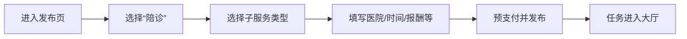
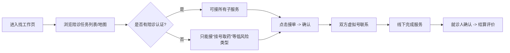

# “邻里” H5 V1.2 产品迭代文档

**版本号**：V1.2  
**迭代主题**：聚焦陪诊核心服务，标准化子服务拆分  
**发布日期**：2026年6月  
**产品经理**：邻里产品团队  

---

## 一、版本背景与目标

### 1.1 背景
前期调研与用户验证表明，在银发族轻就业的C2C场景中，“陪诊”需求最为刚需且供给端（55-65岁银发族）参与意愿高。现有V1.1版本服务分类较分散，用户认知成本高，且未能凸显陪诊的专业性与信任感。为实现快速市场突破，本版本决定**将陪诊定位为平台唯一核心服务**，并拆分为标准化子服务，降低用户选择门槛，提升匹配效率。

### 1.2 目标
- **用户侧**：让就诊人能够根据自身需求精确选择陪诊子服务，减少沟通成本；让陪诊师明确自己可承担的服务类型，提升接单信心。
- **平台侧**：通过标准化子服务形成统一的服务预期与定价基准，便于后续培训、评价与争议处理。
- **商业侧**：聚焦单一品类打造口碑，为后续拓展其他品类积累运营经验。

---

## 二、功能范围

### 2.1 核心功能：陪诊子服务拆分

将原有“陪诊”单一服务，拆分为以下四个标准化子服务：

| 子服务名称 | 定义 | 适用场景 | 建议定价区间（参考） |
|-----------|------|----------|---------------------|
| **全程陪同** | 从出发到返家，全程陪伴老人完成就诊所有环节（挂号、候诊、检查、取药、医嘱记录等） | 行动不便、家属无法陪同、初次就诊或不熟悉医院流程的老人 | 80-120元/半天 |
| **挂号取药** | 仅代为排队挂号、缴费、取药，无需全程陪诊 | 老人已明确诊断，仅需定期开药或取药 | 30-50元/次 |
| **门诊陪护** | 在诊室外的候诊、检查、缴费环节提供陪伴，不进入诊室（隐私保护） | 老人能自行与医生沟通，但需要有人帮忙看管物品、提醒时间、协助缴费 | 50-80元/次 |
| **代为问诊** | 代替老人向医生描述病情、记录医嘱、取药，老人无需到场 | 老人行动极度不便或异地，需子女或陪诊师代为沟通 | 60-100元/次（需额外授权书） |

> 注：实际定价由就诊人在发布时根据子服务类型和时长自定义，平台提供建议区间。

### 2.2 辅助功能调整

#### 2.2.1 发布任务页改造
- **原流程**：选择任务类型 → 填写信息 → 支付
- **新流程**：选择“陪诊” → 选择子服务类型（四个单选按钮，附文字说明） → 填写详细信息 → 支付
- **新增字段**：
  - 子服务类型（必选）
  - 就诊医院名称及科室（文本输入，建议带自动补全）
  - 患者基本信息（年龄、基础病等，可选）
  - 是否需要特殊协助（如轮椅、翻译等）

#### 2.2.2 陪诊师技能认证强化
- 陪诊师申请接单时，需完成**陪诊专项认证**：
  - 观看平台提供的标准化陪诊培训视频（含医患沟通、急救常识、隐私保护等）
  - 通过线上测试（10道选择题）
  - 上传健康证或体检报告（可选但加分）
- 认证通过后，可在个人中心显示“陪诊认证”标识，并选择可提供的子服务类型（多选）。

#### 2.2.3 任务卡片与地图标记优化
- 任务列表和地图气泡中，子服务类型以小标签形式显示（如“全程陪同”“代为问诊”）。
- 增加“陪诊专项保险”标识，强化安全感。

#### 2.2.4 评价体系细化
- 评价维度增加：
  - 对陪诊服务的专项评价（如：准时、沟通清晰、熟悉流程、态度亲切）
  - 是否完成全部服务内容（如未完成可勾选缺失项）
- 评价结果将影响陪诊师的“陪诊技能分”。

### 2.3 移除或隐藏的功能
- 其他非陪诊服务（如代取快递、上门做饭等）从首页金刚位、发布页、任务大厅中**暂时隐藏**，后台保留数据但前端不展示。
- 底部导航“找工作”页面默认筛选为“陪诊”类任务。

---

## 三、业务流程

### 3.1 就诊人发布陪诊任务流程



### 3.2 陪诊师接单流程



### 3.3 纠纷处理特殊规则
- 若就诊人投诉“未完成约定的子服务内容”，平台调取任务记录（如是否上传了挂号单照片、医嘱记录等），结合双方陈述裁决。
- 对“代为问诊”子服务，要求陪诊师必须上传医生签名或处方照片作为完成凭证。

---

## 四、界面改动描述

### 4.1 发布任务页（关键改动）

**原界面**：任务类型九宫格 → 通用表单  
**新界面**：

```
┌─────────────────────────────────────┐
│ 发布陪诊任务                         │
├─────────────────────────────────────┤
│ 选择服务类型：                       │
│ ○ 全程陪同（80-120元/半天）         │
│ ○ 挂号取药（30-50元/次）            │
│ ○ 门诊陪护（50-80元/次）            │
│ ○ 代为问诊（60-100元/次）           │
│   [查看详细说明]                     │
├─────────────────────────────────────┤
│ 就诊医院：________ [选择医院]        │
│ 科室：________                      │
│ 期望时间：2026-06-05 09:00          │
│ 报酬：¥____  (建议价)                │
│ 备注：________ (可选)                │
├─────────────────────────────────────┤
│ ✅ 已包含陪诊意外险                   │
│        [确认发布并支付]               │
└─────────────────────────────────────┘
```

### 4.2 任务详情页（新增子服务标签）

```
┌─────────────────────────────────────┐
│ 陪诊任务 - 全程陪同          ¥90     │
│ 状态：待接单                         │
├─────────────────────────────────────┤
│ 服务类型：[全程陪同]                 │
│ 医院：朝阳医院 呼吸科                │
│ 时间：明天 9:00                      │
│ 患者：张爷爷，78岁，行动不便          │
│ 备注：需帮忙推轮椅                    │
├─────────────────────────────────────┤
│ 发布人：李阿姨  ★★★★☆               │
│ [联系TA]                             │
├─────────────────────────────────────┤
│              [确认接单]              │
└─────────────────────────────────────┘
```

### 4.3 个人中心 - 陪诊认证入口

新增“陪诊技能”模块，显示认证状态和可接子服务类型，提供培训和考试入口。

---

## 五、数据埋点需求

| 埋点事件 | 参数 | 目的 |
|---------|------|------|
| 选择子服务类型 | service_type | 分析各子服务需求占比 |
| 认证考试完成率 | score, user_id | 评估培训效果 |
| 接单后实际完成子服务与发布是否一致 | task_id, matched | 发现错配问题 |
| 纠纷中涉及子服务未完成的比例 | dispute_reason | 优化服务定义 |

---

## 六、运营配合事项

### 6.1 上线前准备
- **培训材料**：制作四个子服务的标准操作流程视频（每个5-8分钟），配上大字号字幕。
- **社区推广话术**：针对就诊人强调“陪诊细分服务，按需选择，省钱省心”；针对银发族强调“只做擅长的，容易上手，平台派单”。
- **老用户触达**：向已注册用户发送模板消息，告知服务升级，并赠送一张“陪诊优惠券”。

### 6.2 上线后运营
- **种子陪诊师激励**：前50名完成陪诊认证并完成首单的陪诊师，奖励50元现金。
- **典型案例收集**：收集“代为问诊”等远程服务案例，用于后续信任背书。

---

## 七、风险与应对

| 风险 | 应对措施 |
|------|----------|
| 其他服务被移除导致用户流失 | 隐藏而非删除，后台保留数据；若用户有强需求可通过客服人工发布 |
| 子服务定价争议 | 初期提供建议价，允许自定义；上线两周后根据成交数据调整建议价 |
| “代为问诊”医疗风险 | 要求陪诊师上传处方/医嘱照片；协议中明确不替代医生诊断 |
| 陪诊师培训完成率低 | 培训视频控制在5分钟内，支持语音讲解，完成认证后给予信用分奖励 |

---

## 八、开发排期（预估）

| 模块 | 前端人天 | 后端人天 | 合计 |
|------|---------|---------|------|
| 发布页改造（子服务选择） | 1.5 | 1 | 2.5 |
| 任务详情/列表子服务标签 | 1 | 0.5 | 1.5 |
| 陪诊认证流程（培训+测试） | 2 | 2 | 4 |
| 评价体系细化 | 1 | 1 | 2 |
| 隐藏其他服务 | 0.5 | 0 | 0.5 |
| 接口调整（任务类型、筛选） | 0 | 1.5 | 1.5 |
| 测试与修复 | 1 | 1 | 2 |
| **总计** | **7** | **7** | **14** |

> 按2前端+2后端并行，约需5个工作日。

---

## 九、验收标准

- [ ] 发布任务时，必须选择且仅能选择一个陪诊子服务，否则无法发布
- [ ] 任务列表和地图气泡正确显示子服务标签
- [ ] 未完成陪诊认证的陪诊师无法接“全程陪同”“代为问诊”子服务（可接“挂号取药”“门诊陪护”）
- [ ] 认证流程：观看视频 → 考试（≥80分通过） → 获得认证标识
- [ ] 评价页面增加陪诊专项评分项
- [ ] 非陪诊类任务不在前端任何位置展示

---

**文档状态**：待评审  
**评审时间**：2026年6月X日  

---