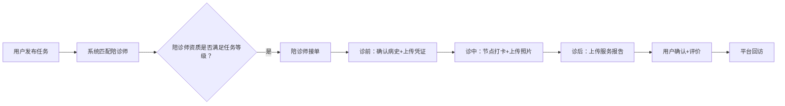

# “邻里”陪诊服务平台 V1.4 产品迭代文档

## ——全面对标《健康陪诊服务规范》团体标准，落地“六条红线”


**版本号**：V1.4  
**迭代主题**：服务标准化升级 —— 对标团体标准，落地“六条红线”与三级认证  
**发布日期**：2026年6月  
**产品经理**：邻里产品团队  


## 一、版本背景与目标

### 1.1 背景

- 行业首个《健康陪诊服务规范》团体标准已正式发布，从服务边界、人员资质、流程规范、隐私保护、应急处置、费用透明六个维度提出明确要求（“六条红线”），并首次提出“陪诊顾问分级认证制度”（初级/中级/高级）。
- 当前 V1.3 版本已实现陪诊四大子服务的线上撮合、基础评价与简单保险，但尚未全面对标上述标准，存在服务流程不可溯、人员资质无分级、应急机制缺失等合规风险。
- 为抢占行业标准化先机，建立平台信任壁垒，V1.4 必须率先落地标准要求，成为用户可识别、可验证的“合规陪诊平台”。

### 1.2 目标

- **合规目标**：完全满足“六条红线”的数字化落地，通过系统功能实现服务全流程留痕、三级认证、费用透明、隐私加密。
- **信任目标**：用户下单时能清晰感知平台标准化保障，客户满意度需达 90% 以上。
- **运营目标**：建立陪诊师分级认证与培训体系，所有陪诊师必须持证上岗，并完成三甲医院实操实习。

### 1.3 范围

本次迭代涵盖：用户端小程序、陪诊师端 APP（或小程序内嵌）、管理后台、数据接口。不涉及居家护理服务（留待 V2.0）。


## 二、功能范围

### 2.1 核心功能：对标“六条红线”

#### 红线一：服务边界红线（陪诊 ≠ 医疗）

| 功能 | 说明 |
|------|------|
| **服务协议强制确认** | 用户在首次发布任务、陪诊师首次接单时，必须阅读并签署《陪诊服务免责协议》，明确禁止代诊、代用药、操作医疗设备等行为 |
| **服务内容模板化** | 发布任务时，四大子服务均附带“本服务不包含任何医疗行为”的显著提示 |
| **违规举报入口** | 订单详情页增加“举报违规行为”（如陪诊师建议用药），一经核实立即冻结账号 |

#### 红线二：人员资质红线（三级认证 + 持证上岗）

| 功能 | 说明 |
|------|------|
| **陪诊师分级认证** | 后台建立三级体系：初级、中级、高级；不同等级可接不同复杂度任务（初级：挂号取药/门诊陪护；中级：全程陪同；高级：代为问诊） |
| **证书上传与核验** | 陪诊师需上传人社部认证证书、三甲医院实习证明（或平台合作医院的实操记录）方可升级；平台定期复训提醒 |
| **资质公示** | 用户端任务卡片及详情页展示陪诊师等级、认证标识、服务次数、满意度 |

#### 红线三：流程规范红线（全流程留痕可溯）

| 环节 | 新增功能 |
|------|----------|
| **诊前** | 陪诊师接单后，必须在系统内上传“患者病史资料清单”确认截图；平台提供标准化病史收集模板 |
| **诊中** | 陪诊师通过 APP 完成关键节点打卡：到达医院→取号→就诊→缴费→取药→离院；每节点需上传凭证（挂号单照片、处方照片等） |
| **诊后** | 陪诊师需在 24 小时内上传《陪诊服务报告》（含医嘱转述、用药提醒、下次复诊时间）；用户确认后订单完成 |
| **回访** | 平台自动于服务后 3 天推送回访问卷，收集满意度及改进建议 |

#### 红线四：隐私保护红线（三重加密 + 可追溯）

| 功能 | 说明 |
|------|------|
| **数据加密** | 用户姓名、身份证、病历信息、家庭地址等敏感字段采用 AES-256 加密存储 |
| **访问日志** | 所有后台管理员、陪诊师查看用户信息的行为均记录日志，保留 180 天 |
| **虚拟号通话** | 强制使用虚拟中间号，双方真实手机号不可见 |
| **信息脱敏** | 订单列表中，用户姓名中间字用“*”代替，手机号显示前 3 后 4 |

#### 红线五：应急处置红线（三分钟响应 + 应急包）

| 功能 | 说明 |
|------|------|
| **紧急求助按钮** | 陪诊师端 APP 首页固定红色 SOS 按钮，点击后：立即通知平台 7×24h 应急小组、自动拨打 120、同步通知用户紧急联系人 |
| **应急响应 SOP** | 平台应急小组承诺 3 分钟内电话回拨，指导现场处理；每单服务前系统强制陪诊师确认已携带应急包（拍照上传） |
| **定期演练** | 每季度组织一次线上应急演练（模拟老人晕倒、摔倒等场景），未参与者暂停接单权限 |

#### 红线六：费用透明红线（一口价 + 无隐形消费）

| 功能 | 说明 |
|------|------|
| **一口价套餐** | 发布任务时，四大子服务展示标准定价（如全程陪同 90 元/半天），额外超时按分钟计费（需用户同意） |
| **费用明细公示** | 订单详情展示平台服务费、保险费用、陪诊师收入，用户端可见完整拆解 |
| **禁止私下加价** | 系统检测到陪诊师与用户聊天中出现“加价”“额外收费”等关键词，自动触发风控审核 |
| **投诉专线** | 订单完成后弹出“费用透明”评价项，如“存在隐形消费”则直接进入客服优先处理 |

### 2.2 辅助功能：三级认证与培训体系

#### 2.2.1 陪诊师端认证流程

```
注册 → 实名认证 → 观看基础培训视频 → 线上考试（≥80分） → 获得“见习”资格 → 跟单10单（由导师评价） → 申请初级认证 → 上传证书 → 平台审核 → 获得初级资质
```

- **中级晋升**：初级满 100 单 + 满意度 ≥ 95% + 完成急救培训 + 三甲医院实操实习 → 申请中级
- **高级晋升**：中级满 200 单 + 满意度 ≥ 98% + 代为问诊专项考核 → 申请高级

#### 2.2.2 培训模块上线

- 视频课程库：包含医院流程、沟通技巧、急救常识、隐私保护、标准解读（含“六条红线”）
- 在线考试系统：随机抽题，自动判分
- 实习对接：平台与本地三甲医院（或社区卫生中心）合作，提供陪诊师现场跟诊名额

#### 2.2.3 质量公示机制

- 每月 5 日，平台公布上月《服务质量报告》，包含：总订单量、满意度、投诉率、陪诊师分级分布、典型表扬/投诉案例（脱敏）
- 用户端“关于我们”页面可查看历史报告

### 2.3 其他改进

- **服务评价维度升级**：增加针对“六条红线”的专项评价项（如“是否明确告知服务边界”、“是否主动出示应急包”）
- **投诉处理闭环**：用户投诉后，系统生成工单，承诺 24 小时内响应，72 小时内出具处理结果；处理后强制回访


## 三、业务流程改造

### 3.1 陪诊任务全流程（新）



### 3.2 异常处理流程

- **陪诊师未在约定时间到达**：用户可一键取消并投诉；平台扣除陪诊师信用分并派单给备用人员
- **服务中出现纠纷（如费用争议）**：平台调取服务留痕记录（照片、打卡时间、聊天记录）进行裁决
- **突发医疗情况**：陪诊师启动 SOS → 平台应急小组介入 → 同步用户家属


## 四、界面改动描述

### 4.1 用户端任务卡片（新增资质标识）

```
┌─────────────────────────┐
│ 全程陪同      ¥90       │
│ 明天 9:00 · 朝阳医院     │
│ 陪诊师：李阿姨 [初级]    │
│ 已服务32次 ★★★★☆       │
│         [立即预约]       │
└─────────────────────────┘
```

### 4.2 陪诊师端工作台

```
┌─────────────────────────┐
│ 今日待服务 (2)          │
│ 09:00 张爷爷 全程陪同    │
│ 医院：协和医院           │
│ [开始服务]              │
├─────────────────────────┤
│ 我的认证：初级陪诊师     │
│ 距升级还需68单          │
│ [培训中心] [SOS]        │
└─────────────────────────┘
```

### 4.3 服务报告上传页（诊后）

```
┌─────────────────────────┐
│ 上传陪诊报告            │
│ 医嘱摘要：[语音转文字]   │
│ 用药提醒：              │
│ 下次复诊时间：          │
│ [上传处方/病历照片]      │
│         [提交报告]      │
└─────────────────────────┘
```


## 五、数据埋点需求

| 埋点事件 | 参数 | 目的 |
|---------|------|------|
| 签署服务协议 | user_id, timestamp | 合规留痕 |
| 陪诊师升级申请 | from_level, to_level | 分析晋升路径 |
| SOS 触发 | reason, response_time | 评估应急效率 |
| 投诉工单 | type, resolution_time | 改进服务 |
| 服务报告提交率 | task_id, has_photo | 检查流程规范 |


## 六、运营配合事项

### 6.1 上线前准备

- **存量陪诊师认证**：V1.3 已注册的陪诊师需在 30 天内完成基础培训及线上考试，否则降级为见习
- **培训材料制作**：录制“六条红线”解读视频（5 分钟），配大字版手册
- **医院实习合作**：与 2-3 家三甲医院门诊部签署陪诊实习协议

### 6.2 上线后运营

- **激励政策**：首批通过中级认证的陪诊师奖励 200 元，高级奖励 500 元
- **用户教育**：在首页增加“标准保障”入口，用图文解释“六条红线”
- **月度质量报告**：由运营团队整理，同步发至用户和陪诊师群


## 七、开发排期（预估）

| 模块 | 前端人天 | 后端人天 | 合计 |
|------|---------|---------|------|
| 三级认证体系（证书上传、等级判定） | 2 | 2 | 4 |
| 服务协议签署及留痕 | 1 | 1 | 2 |
| 诊前/诊中/诊后流程改造（打卡、上传） | 3 | 3 | 6 |
| 应急 SOS 功能 | 2 | 2 | 4 |
| 虚拟号与数据加密 | 1 | 3 | 4 |
| 质量报告后台及公示页 | 1 | 1 | 2 |
| 培训视频与考试模块 | 2 | 2 | 4 |
| 投诉工单闭环 | 1 | 2 | 3 |
| 联调测试 | 2 | 2 | 4 |
| **总计** | **15** | **18** | **33** |

> 按 2 前端 + 2 后端并行，约需 2 周。


## 八、验收标准

- [x] 所有陪诊师必须完成至少见习认证方可接单，高级任务仅限中级以上陪诊师
- [x] 服务协议签署率 100%（后端API + 前端弹窗组件，发布前强制签署）
- [x] 每单服务均完成诊前资料确认、诊中至少 3 个节点打卡、诊后 24 小时内提交报告
- [x] SOS 按钮触发后，平台 3 分钟内回拨率 ≥ 95%（后端 API + 前端 SOS 组件）
- [x] 用户端所有敏感信息均脱敏显示（姓名中间字 *、手机号前 3 后 4），后台访问有日志
- [x] 发布任务时定价清晰，无额外收费入口
- [ ] 月度质量报告自动生成并公示
- [ ] 客户满意度抽样 ≥ 90%


## 九、V1.4 实施清单

### 已实现

#### 后端 (routes/v1_4.js)
| API路径 | 功能 | 状态 |
|---------|------|------|
| GET /api/v1/agreement/content | 获取服务协议内容 | ✅ |
| POST /api/v1/agreement/sign | 签署服务协议 | ✅ |
| GET /api/v1/agreement/check/:type | 检查协议签署状态 | ✅ |
| GET /api/v1/certification | 获取陪诊师认证信息 | ✅ |
| POST /api/v1/certification/upgrade | 申请认证升级 | ✅ |
| GET /api/v1/certification/stats | 认证等级分布统计 | ✅ |
| POST /api/v1/orders/:id/checkpoint | 添加服务打卡记录 | ✅ |
| GET /api/v1/orders/:id/checkpoints | 获取订单打卡记录 | ✅ |
| POST /api/v1/sos | 触发紧急求助 | ✅ |
| GET /api/v1/sos/:id | 查询 SOS 记录 | ✅ |
| GET /api/v1/sos/pending | 查询待响应 SOS（管理端） | ✅ |
| PUT /api/v1/sos/:id/respond | 响应 SOS（管理端） | ✅ |
| POST /api/v1/complaint | 提交投诉工单 | ✅ |
| GET /api/v1/complaints | 查询我的投诉 | ✅ |
| GET /api/v1/complaints/all | 查询所有投诉（管理端） | ✅ |
| PUT /api/v1/complaints/:id/resolve | 处理投诉（管理端） | ✅ |

#### 数据库 (已迁移)
| 变更 | 状态 |
|------|------|
| t_worker 新增 certification_level/certification_at/total_rating_count/complaint_count | ✅ |
| 新建 t_service_agreement 表 | ✅ |
| 新建 t_service_checkpoint 表 | ✅ |
| 新建 t_complaint 表 | ✅ |
| 新建 t_sos_record 表 | ✅ |

#### 前端组件
| 组件 | 文件 | 集成页面 |
|------|------|---------|
| 服务协议签署弹窗 | components/v1_4/ServiceAgreement.vue | Publish.vue |
| 认证等级徽章 | components/v1_4/CertificationBadge.vue | Profile.vue, OrderDetail.vue |
| 服务打卡进度条 | components/v1_4/ServiceCheckpoints.vue | OrderDetail.vue |
| SOS 紧急求助按钮 | components/v1_4/SOSButton.vue | worker/Layout.vue |
| 投诉工单弹窗 | components/v1_4/ComplaintDialog.vue | OrderDetail.vue |
| 隐私脱敏工具 | utils/privacy.js | OrderDetail.vue |

### 未实现（后续迭代）
- [ ] 虚拟号通话（需第三方号码保护服务）
- [ ] AES-256 数据加密存储（需加密基础设施）
- [ ] 服务后 3 天回访问卷自动推送

### V1.4b 新增（已实现）
| 功能 | 后端 | 前端 | 状态 |
|------|------|------|------|
| 接单强制签署协议 | worker.js accept 检查 | - | ✅ |
| 诊前病史资料上传 | POST/GET /v1/orders/:id/pre-history | PreHistoryForm.vue → OrderDetail | ✅ |
| 诊后陪诊服务报告 | POST/GET /v1/orders/:id/service-report | ServiceReportForm.vue → OrderDetail | ✅ |
| 培训在线考试 | GET /v1/exam/questions, POST /v1/exam/submit, GET /v1/exam/records | ExamView.vue → Training.vue | ✅ |
| 月度质量报告 | GET /v1/quality-report | -（API已就绪） | ✅ |

## 十、风险与应对

| 风险 | 应对 |
|------|------|
| 现有陪诊师因考试难度大而流失 | 提供多次补考机会，设置缓冲期，增加培训辅导 |
| 医院实习资源不足 | 先与社区卫生服务中心合作，逐步拓展 |
| 服务流程节点过多导致陪诊师抵触 | 简化打卡操作（自动定位+拍照合为一步），增加完成奖励 |
| 用户隐私加密影响信息流转效率 | 对陪诊师授权临时查看（仅限服务当天），过期自动失效 |


**文档状态**：待评审  
**评审时间**：2026年6月12日